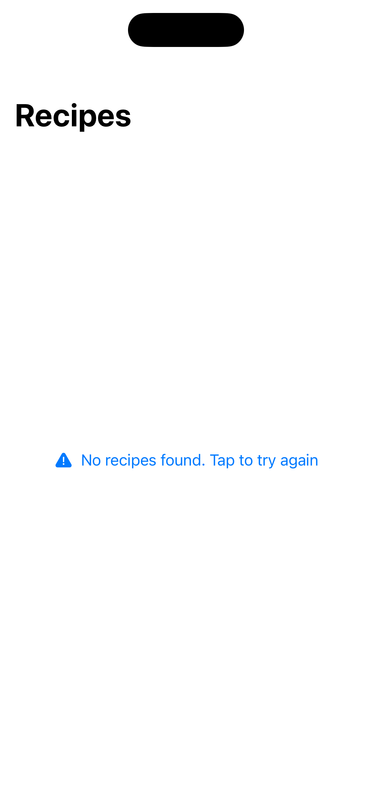
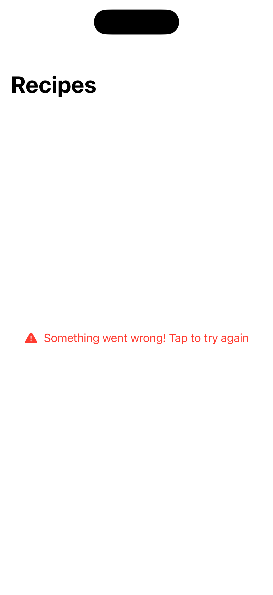
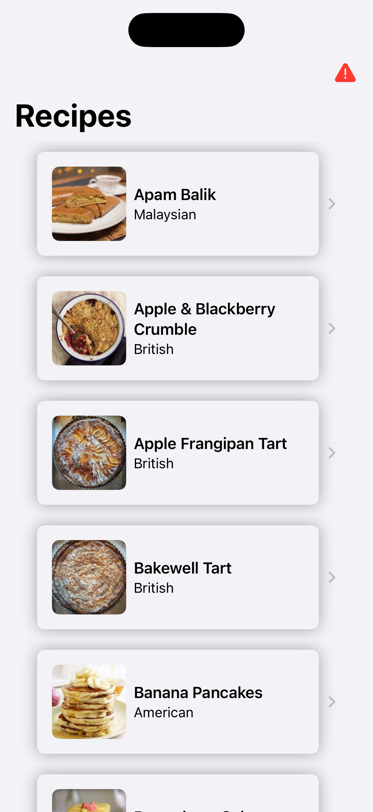
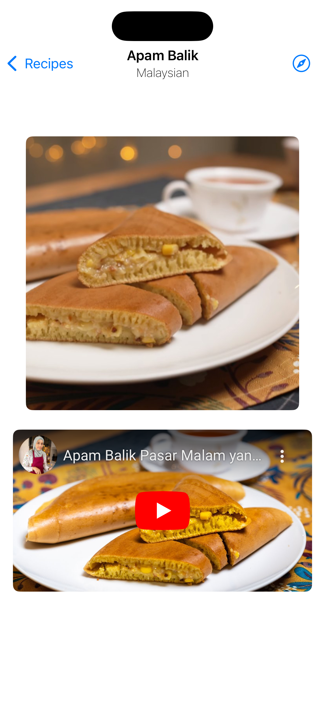

### Summary: Include screenshots or a video of your app highlighting its features

The app provides a list of recipes fetched from the internet. The recipes will
contain their name and their cuisine. Optionally will also contain a thumnail
photo, link to original source, and link to youtube video.

First the user sees the list of recipe cards. If the recipe contains a youtube 
video the card can be tapped to review a detailed view of the recipe. If the 
recipe only contains the source link the card redirects the user to that instead.
Recipe cards with no source or youtube can't be tapped.

| All Recipes | Empty Recipes | Error Recipes Empty | Error Recipes Full | Recipe Detail |
|-------------|---------------|---------------------|--------------------|--------------|
||||||

[Demo video](https://drive.google.com/file/d/1ST7UbG4KFUtpp4C5dfVIMe5q1p42G6lr/view?usp=sharing)

### Focus Areas: What specific areas of the project did you prioritize? Why did you choose to focus on these areas?

The project was done with special focus on a few key areas: 
 1. Composability
    - Special care was taken to break down visual and behavioural pieces into 
     reusable components. That speeds up development in the future since we 
     can take advantage of the work done before, facilitates testing since 
     testing smaller pieces is easier, and allows for better evolution of the 
     code base since each component can be updated individually. 
    - A good example of this is the `ImageView` file. It takes advantage of two
     components: `AsyncTaskView` and `ImageCache`. The first manages the state
     of an asynchronous task (loading an image in this case); while the second
     handles the disk cache and loading of images (perfoms the asynchronous task).
     All that allows for the `ImageView` file to focus only on its SwiftUI 
     implemntation.
    - Sensible default parameters were chosen where appropriate to allow for 
     customization when needed while still making components easy to use.
 2. Readability
    - Self-documenting descriptive names for entities, methods and properties of
     the project were chosen. The single responsibility principle was taken into
     account where appropriate without going overboard.
    - Custom helpers and extensions were used sparingly to avoid syntatic noise
     and draw the focus into the main function of each code block.
    - Documentation comments were added to give insight on how helpers should be
     used and how they behave. Unit tests were also used as a quick way to find 
     examples on how helpers are used.
 3. Performance
    - "Lazy" SwiftUI components such as `List` were chosen over `ScrollView` + 
     `VStack` to take advantage of their recycling behaviour. Only are few list
     rows are loaded into memory at a time (enough to fill the screen) and they
     are reused as the user scrolls. Each row only loads their images once they 
     come into the screen.
    - Images are cached to disk and only loaded from the internet if a suitable
     file isn't cached yet. Avoiding unnecessary network calls.

### Time Spent: Approximately how long did you spend working on this project? How did you allocate your time?

I spent about 8 hours on this project. The first 2-3 hours were focused on
getting as much of the core functionality done. The next hour were focused 
on cleaning up quickly cobbled together pieces (rename properties, split methods,
extract functionality). About 2 hours were spent adding the more advanced features
such as the image cache and the inline youtube video web view. The last 2 hours
were spent on writing unit tests, manually testing to find and if edge cases, 
updating documentation, and adding a few final touches like the app icon.

### Trade-offs and Decisions: Did you make any significant trade-offs in your approach?

Since SwiftUI doesn't support embedding web views in a declaritive way a briding
view using a little of UIKit had to be used to implement `HTMLView` and support
the embedded youtube video. To support loading and error states for that view
a reduced equivalent of `AsyncTaskView` had to be reimplemented using UIKit on 
the `HTMLView` coordinator. Since this project focuses on SwiftUI views that
equivalent reimplementation wasn't extracted into its own component.

### Weakest Part of the Project: What do you think is the weakest part of your project?

The design of the app is not very well flushed out. While I tried to keep
everything cohesive many elements use the iOS defaults. The `RecipeDetail` view 
suffers the most from this. It can look empty while the youtube video is loading.
A good future direction could be trying to fetch the recipe ingredients and 
instructions from the source link if present.

### Additional Information: Is there anything else we should know? Feel free to share any insights or constraints you encountered.

A major constraint is the fact that SwiftUI still has a few gaps on the equivalency with UIKit. As mentioned before this
constituted on the trade-off of having to use `UIViewRepresentable` to port `WKWebView` to SwiftUI. 

Previews were used as more than just a development tool. They were written with the intention to show as much as
possible how the view behaves on different circumstances, for example `RecipeList`s preview is embedded in a tab view
that triggers 3 different test endpoints that return a good response, empty respone, and malformed response. 
